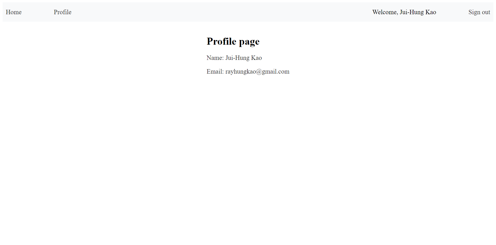

This project is under a training plan for being a web frontend engineer. \
Below are the key results: one homework and a presentation that comprises the concepts and usage of firebase authentication.

### Homework 9 SSO Login

- Basic requirement: (w 2 pages)
  - implement SSO login via Firebase ( Google / Facebook)
  - get email / name from Firebase and show on the screen
- Advanced:
  - decorates UI with Scss/Sass
- Implementation
  - deployment on Vercel
  

    
    
    
    
  

### Presentation

[Week5: Firebase Authentication](https://docs.google.com/presentation/d/170urGVbxeUDgYTRXQiedsAXKAhVvprS-2WKk6e7KuZ4/edit?usp=sharing), which includes:

- Add Add firebase to a JavaScript app
- Add firebase authentication to a JavaScript app
- Add SSO: sign in with Google, Facebook